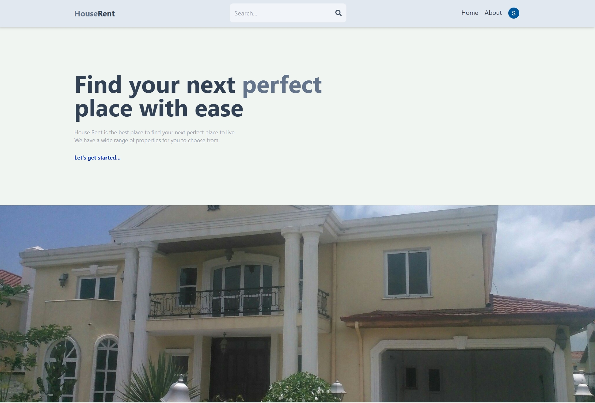
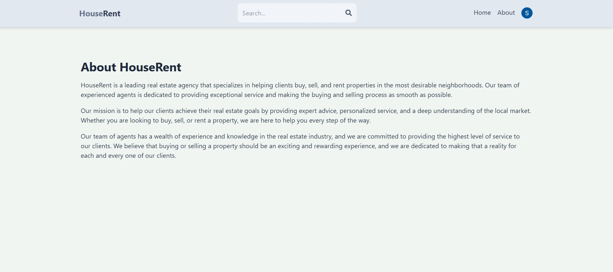
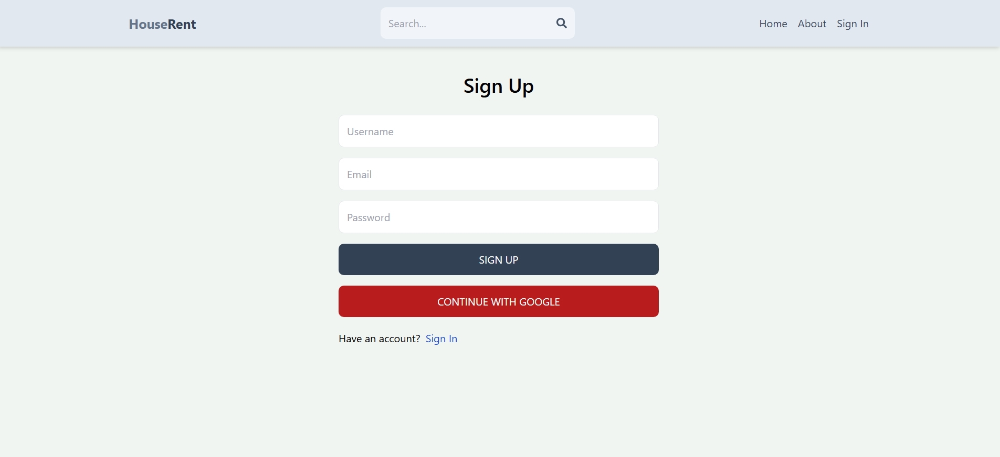
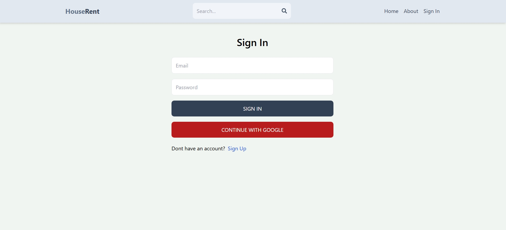
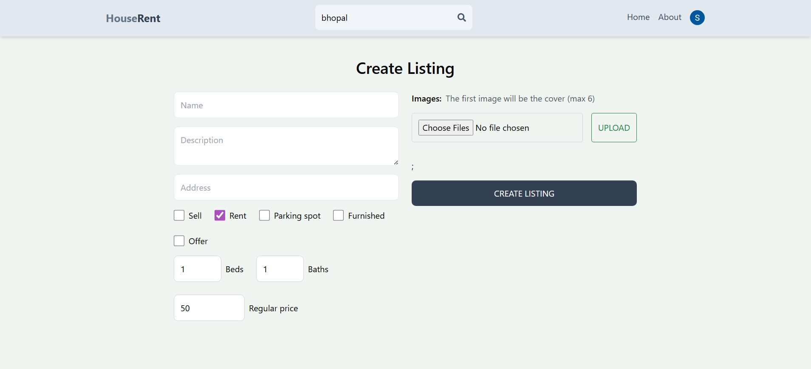
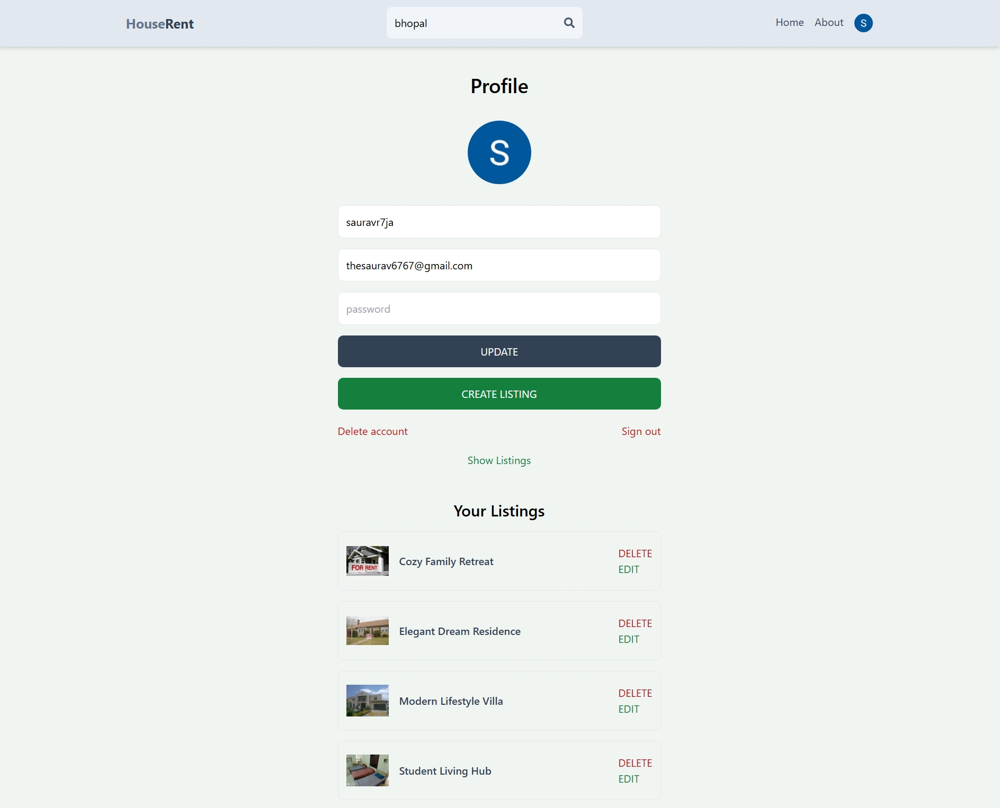
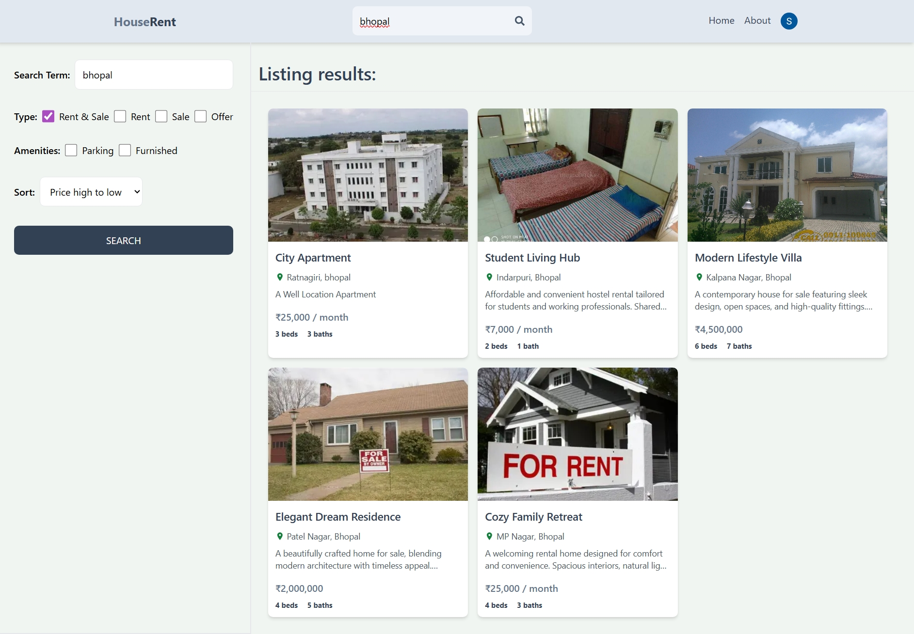
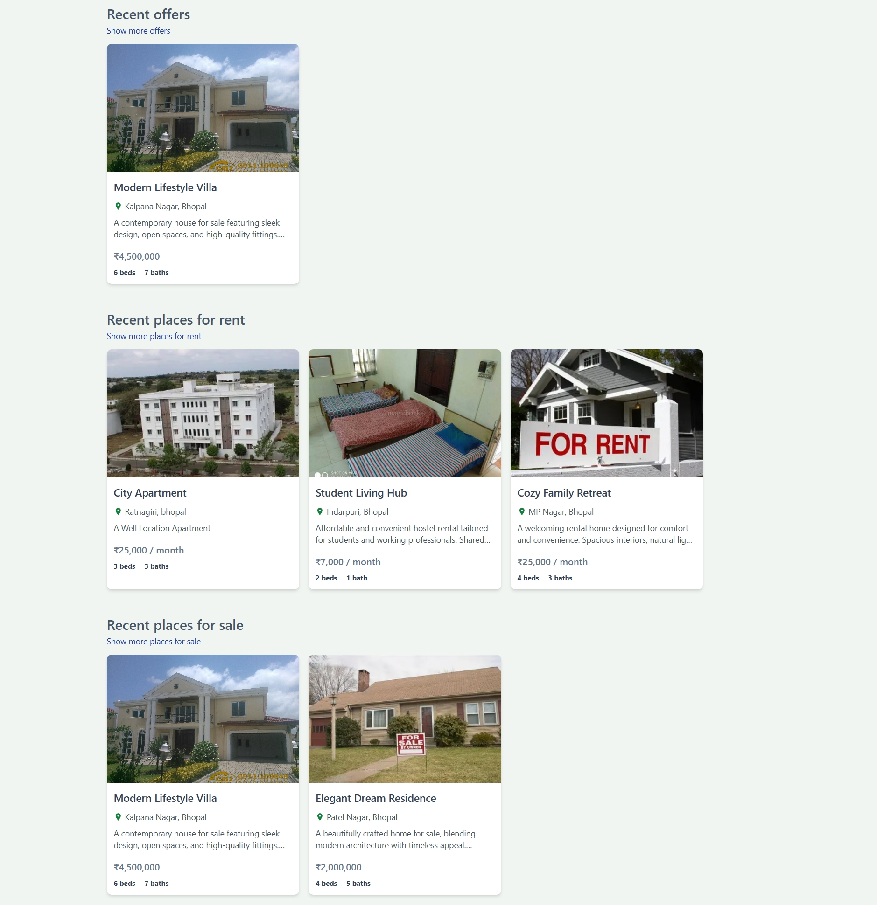

# 🏠 HouseRent MERN Project

A full‑stack real estate HouseRent application built with the **MERN stack (MongoDB, Express.js, React.js, Node.js)**.  
This project allows users to browse, create, update, and search property listings with a clean and modern interface.

---

## ✨ Features
- 🔐 **Authentication**: Sign up, sign in, and manage user profiles
- 🏡 **Listings Management**: Create, update, and delete rental property listings
- 🔎 **Search Functionality**: Filter listings by location and keywords
- 📄 **Responsive UI**: Built with React for a smooth user experience
- ⚡ **State Management**: Redux for predictable and scalable state handling
- 🌐 **REST API**: Express.js backend with MongoDB Atlas integration

---

## 🛠 Tech Stack
- **Frontend**: React.js, Redux, Vite
- **Backend**: Node.js, Express.js
- **Database**: MongoDB Atlas
- **Version Control**: Git & GitHub

---

## 🚀 Getting Started

### Prerequisites
- Node.js (v16+ recommended)
- npm or yarn
- MongoDB Atlas account (or local MongoDB)

### Installation
1. Clone the repository:
    ```bash
    git clone https://github.com/KrSaurav67/HouseRent.git
    cd HouseRent
2. Install dependencies for both client and server:
    cd client
    npm install
    cd ../api
    npm install
3. Create a .env file in the api folder with:
    MONGO_URI=your_mongodb_connection_string
    JWT_SECRET=your_secret_key
4. Run the development servers:
    # In one terminal (backend)
    cd api
    npm run dev
    
    # In another terminal (frontend)
    cd client
    npm run dev
5. Open the app at http://localhost:5173

---

📸 Screenshots
### Homepage


### About Page


### Sign Up Page


### Sign In Page


### Create Listing


### Profile & Listings Management


### Search Results


### Recent Offers & Listings



---

🤝 Contributing
Contributions are welcome!
Fork the repo, create a branch, make your changes, and submit a pull request.


This project is a part of Group Project of SmartBridge.

Members:-


1. Saurav Kumar 
- Email: thesaurav6767@gmail.com
2. Vaishnavi Mishra
- Email: vaishnavi.mishra67009@gmail.com
3. Akshat Tiwari
- Email: tiwariakshat233@gmail.com
4. Varun Patel
- Email: varunpatel506@gmail.com
